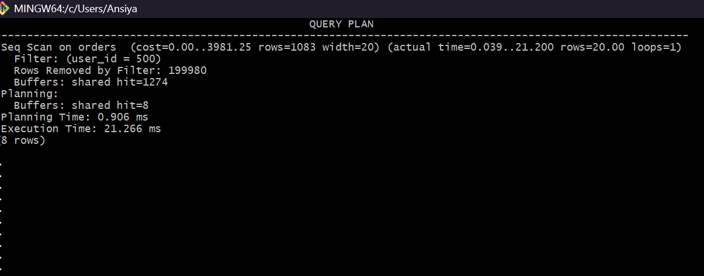
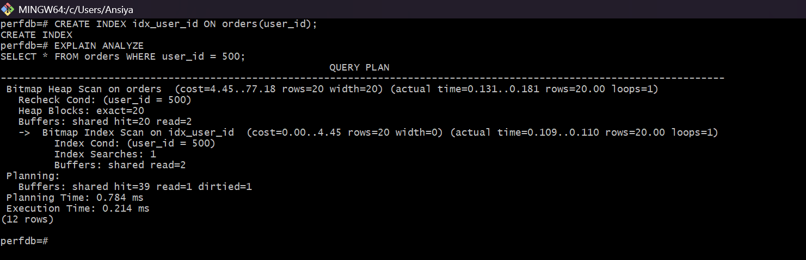
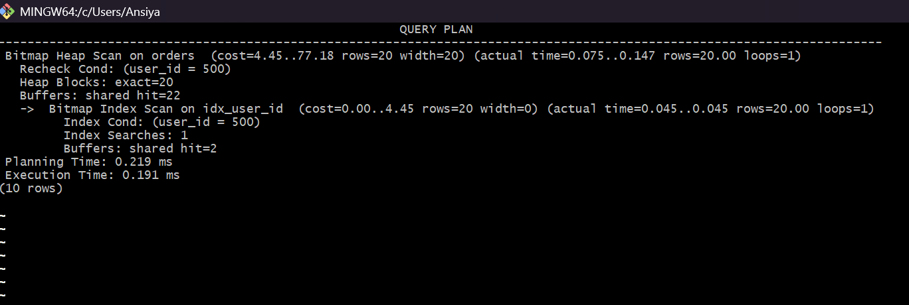

# PostgreSQL Query Performance Optimization

## Project Overview
This project demonstrates how to identify and optimize slow SQL queries using PostgreSQL.

The query performance was analyzed using `EXPLAIN ANALYZE` and improved using indexing.

---

## Slow Query

```sql
SELECT * FROM orders WHERE user_id = 500;
```

---

## Before Optimization



Execution Time: ~21 ms

---

## Index Creation

```sql
CREATE INDEX idx_user_id ON orders(user_id);
```



---

## After Optimization



Execution Time improved from **21 ms → 0.19 ms**

---

## Technologies Used

- PostgreSQL
- Docker
- SQL Query Optimization
- GitHub

---

## Key Learnings

- Understanding PostgreSQL execution plans
- Query optimization using indexes
- Running PostgreSQL in Docker containers
